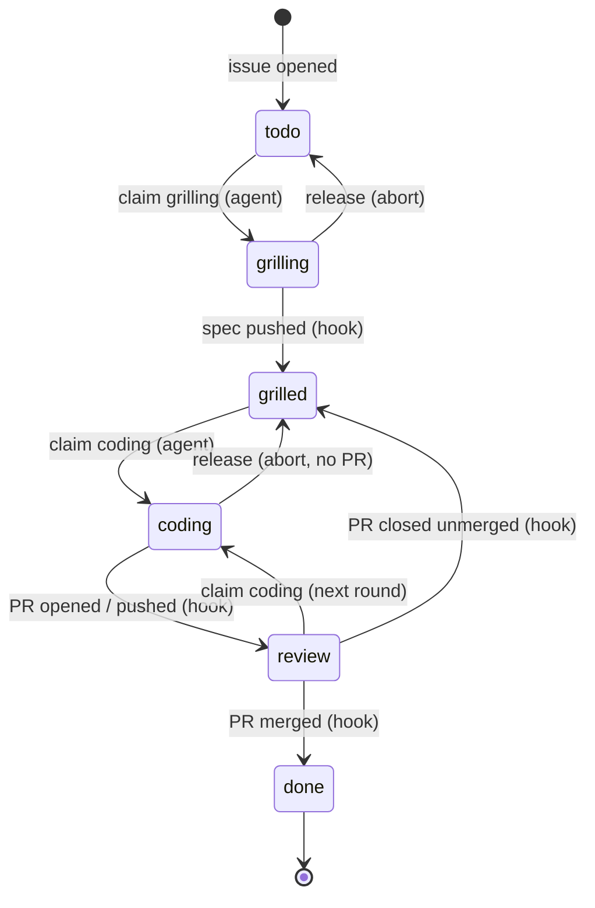

# whackagent on GitHub

How the GitHub backlog provider (`backlog.provider: github`) plugs into the whole whackagent workflow: what lives where, who moves a ticket from one state to the next, and what each command does on GitHub.

With the default `local` provider, the backlog is a Markdown file and one agent works on one checkout. The GitHub provider moves the backlog to a **GitHub Project**, so several agents, in several worktrees or on several machines, share one board without ever working the same ticket at the same time. The skills don't change: they speak the provider contract (`providers/CONTRACT.md`), and the provider maps it onto GitHub.

For the script-level details (every verb, every field mapping, setup internals), see [`providers/github/README.md`](providers/github/README.md).

## The one rule

**Agents take tickets. The repo moves them.**

An agent never writes "this is grilled", "this is in review" or "this is done" on the board. It only *claims* a ticket (a lock) before working on it. Every other state change comes from something that really happened in the repo — a spec pushed, a PR opened, a PR merged — and is applied by a GitHub Actions workflow. So the board always says what the code says, not what an agent believes.

## What lives where

| Thing | Where on GitHub |
| --- | --- |
| Ticket | a repo **issue**. Its number is the ticket id (`#12`). Every issue is a ticket unless labeled `wa-ignore`. |
| Title, summary | issue title, first line of the issue body |
| State | Project `Status` field (the board columns) |
| Priority | card order on the Project (top = next) |
| Size | Project `Size` field: `quickwin`, `medium`, `large` |
| Sprint | a parent issue labeled `wa-sprint`; the sprint name is its title in kebab-case (`AI setup` → `ai-setup`); its tickets are its **sub-issues** (GitHub shows a progress bar) |
| Milestone | the repo's GitHub milestones |
| Dependencies | issue **Relationships** ("blocked by") |
| Spec | the task file `{tasks}/<n>-<slug>.md`, **on the ticket branch**, merged with the code |
| Ticket branch | `wa/<n>-<slug>`, created with `gh issue develop` so it shows under the issue's **Development** panel |
| Change | one PR per ticket, from the ticket branch |
| Lock | a git ref `refs/wa-claims/<n>/<phase>` |
| Reservation | issue **assignees**: assigned to another account = no agent of yours may claim it |

There is no local mirror and no `BACKLOG.md`. The task file carries only whackagent's own data (`issue:`, `phase:`, `wiki:`, `note:`, `created:`, plus `ported-from:` / `lands:` for tracks) plus the spec sections; title, state, size, sprint and milestone live on GitHub only.

The machinery is three pieces:

- **`wa-backlog`** (`providers/github/wa-backlog`): a Python script (stdlib + `gh`) that implements every contract verb. Skills call it for every backlog read or write.
- **`whackagent-board.yml`**: the hooks workflow, installed in the project's `.github/workflows/`. It reacts to issue, push and PR events and moves the board. The project file is a small caller: the logic is the reusable workflow `rlatapy-luna/whackagent/.github/workflows/board.yml@hooks-v1`, and each whackagent release moves that tag, so every project runs the new logic without a PR. The caller only changes when its triggers, permissions or secret do.
- **Repo variables** (`WA_PROJECT_NUMBER`, `WA_STATES`, `WA_BRANCH_PREFIX`, …) shared by the script and the workflow, plus the **`WA_PROJECT_TOKEN`** secret, a classic PAT with `project` + `repo` scopes. The secret is needed because the default Actions token can't write to Projects v2.

## The six states



| State | Meaning | Entered by |
| --- | --- | --- |
| `todo` | the ticket exists, not grilled yet | issue opened, by `/wa-task` or by hand |
| `grilling` | **locked**: one agent is grilling it | agent `claim <n> grilling` |
| `grilled` | spec written, ready to code | hook: ticket branch pushed with a task file holding non-empty `## Acceptance criteria` |
| `coding` | **locked, short-lived**: one agent is working a round right now | agent `claim <n> coding` |
| `review` | a PR is open; humans are on turn | hook: PR opened, or an agent round pushed to it |
| `done` | the change landed | hook: PR merged, issue closed, run report from the PR body posted on it |

Two things to keep in mind:

- **`coding` never waits for a human.** It means "an agent is working right now". Every round ends with a push, the push moves the ticket to `review`, and the lock goes away. Nothing sits in `coding` overnight.
- **`review` has two flavors**, told apart by the PR: a **draft** PR means *your turn to test*, a **ready** PR means *your turn to merge*.

The finer whackagent lifecycle (`in-progress` → `review` → `validated`) still exists, but in the task file's `phase:` field, pushed with each round. Board `review` = PR open; `phase: review` = coded, verifier not run yet; `phase: validated` = verifier passed, waiting for your retest.

## Claims (locks)

Before an agent grills or codes a ticket, it runs `wa-backlog claim <n> grilling|coding`.

- The lock is a git ref, `refs/wa-claims/<n>/<phase>`, pointing at a parentless commit (on a one-file `CLAIM` tree) whose message names the agent (`agent: <host>:<worktree>`, overridable with `WA_AGENT`) and the time.
- GitHub refuses to create a ref that already exists, server-side. When N agents claim the same ticket at the same moment, exactly one wins (tested with six).
- Exit codes are part of the flow: **0** = won, **3** = taken (the script prints who holds it), **4** = wrong state (`grilling` needs `todo`; `coding` needs `grilled` or `review`; closed issues and columns outside the six states are never claimable). A loser never retries and never steals; it moves on to the next ticket or tells you who holds it.
- **Assign yourself to reserve a ticket.** A ticket assigned to another GitHub account than the one `gh` runs as is `reserved`: `claim` refuses it with exit 3, naming the assignee. Unassigned tickets and tickets assigned to you stay claimable. So a dev who wants a ticket for themselves (or for their own agents) assigns it on GitHub, and nobody else's agent will take it. Claiming does the same thing for you: the winning `claim` assigns the account it runs as, so a ticket your agent grilled stays yours through coding and review, and the hooks never unassign it. An aborted claim (`release`) removes the assignment only if that claim made it; one you made by hand stays. Agents never unassign anyone else. `/wa-board` shows reserved tickets with `👤 @login` and never suggests them; `/wa-autopilot` skips them.
- Each claim and release leaves a trail comment on the issue (`🔒 coding — host:path · time`, `🔓 coding released, back to grilled — reason`).

Locks don't expire, because grilling is interactive and you might answer a question two days later. They're dropped by the hooks on the next real transition, or by an explicit `release` when an agent aborts. `wa-backlog claims` flags a lock as **stale** when nothing was pushed for `WA_STALE_AFTER_HOURS` (24 by default); `/wa-board` shows stale locks, and only you clear them, with `/wa-task release <n>`.

## The agent round

Every command that touches a ticket's code (`/wa-code`, `/wa-feedback`, `/wa-validate`, `/wa-close`, `/wa-autopilot`) works as one **round**:

1. `claim <n> coding` (from `grilled`, or from `review` for a later round).
2. Work on the ticket branch.
3. Commit the code **and** the task file (`phase:`, notes, review, verification), with your configured author identity, never as Claude.
4. Push. The first delivery opens a **draft PR**; later rounds push to it.
5. The hook sees the PR `opened` or `synchronize` event, sets `review`, and deletes the claim.

Rules that come with it:

- **No push mid-round.** A push to a branch with an open PR ends the round, so the agent pushes once, at the end.
- **Nothing to push?** The agent releases the claim itself: `--reset-to review` if a PR is open, `--reset-to grilled` otherwise.
- **Conflicting PR = no hook.** GitHub doesn't run `pull_request` workflows while a PR conflicts with its base, so the push moves nothing. After each push the agent checks `mergeable`; on `CONFLICTING` it rebases the ticket's own commits onto the PR base, resolves mechanical conflicts (stops and asks on logic), rebuilds, runs the tests, and force-pushes with lease.

### The PR

- **Opened as a draft**, base = the branch the ticket forked from (sprint branch, else `close.target`). Title, labels, assignees and the PR template come from the `pr:` config block (see the README's *Pull requests*). whackagent's part of the body (summary, `Closes #<n>`, the acceptance criteria as a checklist and a status line such as `Draft — verifier not run yet. Test, then /wa-feedback · /wa-validate · /wa-close.`) sits in a marked block after the filled template.
- **Linked** with `wa-backlog link-pr`: the PR gets the ticket's milestone and a Development link to the issue. (`Closes #<n>` alone only links PRs onto the default branch, and sprint or stacked PRs never are.)
- **Body refreshed every round** from the task file: the marked block is rewritten (current summary, current criteria, `- [x]` only for criteria a round actually proved, a status line saying what's still owed), and template sections are touched only where the round changed what they say. Text a human added stays. A PR body describing superseded behavior is a lying PR.
- **Reviewers** (`pr.reviewers`) are requested when the PR goes ready, at `/wa-close` or on an autopilot ready PR, never on a draft.
- **Screenshots**, when the diff changes UI: uploaded with `gh image` (extension `drogers0/gh-image`) into a `## Screenshots` section. Images are never pushed to a branch.

## Command by command

### `/wa-setup`

Asked early: files or GitHub Project. Choosing GitHub:

- creates a Project or adopts an existing one (`wa-backlog provision`). Existing columns are never rewritten: missing state options are added, or states are mapped onto your existing column names. A `Size` field is added if missing, and the repo variables are written.
- installs `whackagent-board.yml` **through a PR** (never a direct push to the default branch). The hooks are live once it's merged.
- walks you through the `WA_PROJECT_TOKEN` secret: a token link, then `! pbpaste | gh secret set WA_PROJECT_TOKEN -R <repo>` so the token never appears in the chat.
- forces `branch.per_task: true` and `close.strategy: pr`, and drops the `{backlog}` file.
- can import open issues as `todo`, migrate a local backlog, and run a smoke test (create → claim → release → close).

### `/wa-task` — create

`wa-backlog create` opens an issue in `todo`, at the **bottom** of the board, in the highest open milestone (by version order of titles), with your idea or spec excerpt as the issue body. Dependencies become issue relationships (`wa-backlog depend`). No claim, no branch, no task file yet: grilling creates those.

Prioritization is **never automatic** under GitHub, because the board order is shared with humans and other agents. Only `/wa-task` with no argument proposes a new order, and it's applied (`wa-backlog move`) on your yes. Canceling a ticket = closing the issue as "not planned", on your yes.

### `/wa-grill #12`

1. `claim 12 grilling`.
2. Creates the ticket branch **linked to the issue** right away: `gh issue develop 12 --name wa/12-<slug> --base <fork point>`. Only branches GitHub creates can be linked; a plain `git checkout -b` plus push can never be linked afterwards.
3. Grills you, writes `{tasks}/12-<slug>.md` with non-empty acceptance criteria. Dependencies found while grilling become issue relationships.
4. Commits the task file (`task: grill #12 <slug>`) and pushes, once, at the end.
5. The hook sees the spec on the branch and moves the ticket to `grilled`, dropping the grilling lock.

Abort → `release --reset-to todo`, and the empty remote branch is deleted. A split → the parent is released and becomes the sprint root (`split`: label `wa-sprint`, off the board, number, history and milestone kept; sprint name = its title in kebab-case), and the children become new tickets in its milestone, as its sub-issues. A parent already in a sprint can't become one: its children join that sprint and it is closed with a comment linking them.

### `/wa-code #12`

Without an argument, it picks the top unclaimed `grilled` ticket. It claims `coding`, checks out the existing ticket branch (never creates a new one: the spec lives there), and runs the normal pipeline. Once the task is broken into bricks, they're posted as one issue comment, one line per brick (a later round that re-plans posts a new comment; the issue body is never edited). The round ends with commit, push and a draft PR; the hook moves the ticket to `review`. The first push of a ticket asks for a one-line confirmation; later rounds push without asking.

### `/wa-feedback #12 <notes>`

Claims `coding` from `review`. Its input is your notes **plus the PR's review comments**, triaged the same way. A PR already marked ready is turned back into a draft first, so nobody merges code that is moving. The round ends with a push and a body refresh; the ticket goes back to `review`, and the hook comments on the ticket and on the PR with a permalink to the new `## Feedback` round in the task file (what you asked, triage, what changed, verdicts). GitHub embeds those lines as a snippet; the task file stays the source of truth.

### `/wa-validate #12`

Claims `coding` from `review`, runs the project tools and the verifier over the ticket's whole diff, autofixes, then commits the task file (`phase: validated`, `## Review`) and the fixes, pushes, and refreshes the PR body. The ticket waits for your retest in `review`. `validated` is internal to whackagent: the board never shows it.

### `/wa-close #12`

The last round, always shown as a plan and confirmed before it runs:

1. Claims `coding`, syncs the wiki, commits on the ticket branch, so docs ride in the same PR.
2. Rebases the ticket's own commits onto the PR base, then rebuilds and reruns the tests.
3. Force-pushes with lease, refreshes the body, links the PR, and runs `gh pr ready`: draft becomes ready, meaning *your turn to merge*.
4. The hook keeps `review` and drops the claim.

**Merging is yours** (or your project's merge policy). The hook then sets `done` and closes the issue. The branch is kept until then, because the PR needs it.

### `/wa-autopilot`

Several autopilots, on several machines, can run on one board at once; claims keep them apart.

- Scope = unclaimed `grilled` tickets in board order, or a sprint, a milestone or a list of tickets.
- Each ticket is claimed just before its wave starts, not the whole batch up front, so later tickets stay free for other agents. A ticket someone else holds is skipped.
- Open PRs are checked before planning: a ticket touching the same files as an open PR gets a merge-conflict warning in the plan.
- Each ticket gets a worktree on its existing branch, and its bricks comment right after its claim.
- Delivery: verifier clean → **ready PR** with checked criteria (*test, then merge*); findings left open → **draft PR**. A blocked ticket is released back to `grilled` with the blocking question as the reason, so the question lands on the issue.
- **AFK mode** (`/wa-autopilot afk`) also grills `todo` tickets unattended, answering with its own recommendations tagged `(autopilot assumption)`, and stacks dependent tickets without a depth limit.

### `/wa-board`

Reads `wa-backlog list`, `milestones` and `claims` instead of a file. On top of the usual dashboard it shows who holds which lock, **stale locks** (with the `/wa-task release` to run), Project draft items (not tickets yet: convert them to issues), and the `review` section split into 🧪 draft (your test) and 🔀 ready (your merge). It never suggests a ticket someone else holds.

### `/wa-release 0.3.0`

Same flow as with files. Readiness comes from `wa-backlog list --milestone`, and the milestone is closed with `close-milestone` only at the end, on your yes. Release PRs and GitHub releases are run with `gh`, each confirmed separately. The hooks ignore release PRs: they aren't ticket PRs.

## Sprints, milestones, dependencies

- **Sprint** = parent issue (`wa-sprint` label) with the tickets as sub-issues. `set-field <n> sprint <name>` creates the parent on first use; a grill split turns the split ticket itself into the parent. Ticket branches fork off the sprint branch `sprint/<name>`, and ticket PRs target it. When the last ticket lands, `/wa-close` proposes the sprint PR onto `close.target`; merging it closes the parent. Without sprint branches (`WA_SPRINT_PREFIX=none`), the parent closes when its last sub-issue lands.
- **Milestone** = release scope, not a sprint. You create milestones on GitHub. New tickets join the highest open one (version order of titles), so they never grow the scope that's about to ship. The hooks never touch milestones.
- **Track** = long-shot feature on its own long-lived trunk (`branch.tracks: {server: develop_synchro}` in the config, keyed by milestone title). Tickets in that milestone fork from and PR into the track branch, and new tickets never land there by default: `/wa-setup` passes each track to `provision --track`, stored in the `WA_TRACKS` repo variable, so `create` skips it. The hooks need nothing new: track PRs merge like any other, and sync branches (`wa-sync/<track>-<date>`) don't match the ticket prefix. See [Tracks](README.md#tracks).
- **Dependencies** = "blocked by" relationships. `/wa-autopilot` makes a ticket wait for its blocker's wave, or **stacks** it: the dependent PR targets the blocker's branch. Provisioning turns on `delete_branch_on_merge`, so merging the bottom PR deletes its branch and GitHub retargets the next PR automatically.

> **Don't delete a stacked branch by hand.** GitHub retargets dependent PRs only when the branch is deleted at merge time. Deleting it later (`git push --delete`, the API) **closes** every PR based on it. Retarget those PRs first.

## Squash merges and the ticket range

PRs are assumed to land squashed. After a parent or stacked ticket is squash-merged, the base no longer contains that ticket's original commits, so `git merge-base` and a plain `git rebase <base>` replay already-landed work and conflict on every commit.

So the agents never diff or rebase from `<base>..HEAD`. They use the **ticket range**: the ticket's own commits, starting at its grill commit (`task: grill #<n> …`).

```
start=$(git log --format=%H --grep="^task: grill #12 " wa/12-login-apple | tail -1)
git diff $start^ wa/12-login-apple           # what the ticket changed
git rebase --onto origin/<base> $start^      # move it onto a new base
```

This works whether or not the project squashes.

## Gotchas

- **The workflow must be on the default branch *and* on ticket branches.** `issues` events run the default branch's copy; `push` and `pull_request` events run the pushed ref's copy. Branches forked after the setup PR merged carry it.
- **Custom `branch.prefix`** → edit the workflow's `branches:` filter to match.
- **`list` lags 1–3 minutes** behind new tickets (GitHub indexing). `get` and `claim` read the issue directly and are always current.
- **A late hook is waited for, never helped.** If a state doesn't move, the agent re-reads once, then points you at the Actions run. It never sets the state itself.
- **Hooks version gate.** Before its first push, an agent reads the workflow's `template version` on the PR base. Versions 3–5 keep the claim through the draft until `/wa-close` (a holder on the same host counts as yours); below 3, no draft PRs at all. Either way it tells you to upgrade with `/wa-setup backlog`.
- **Extra columns** (`Blocked`, `In Progress`) are kept as they are and ignored: tickets there are never claimed.
- **Organization Projects** work with the same PAT scopes. A GitHub App path, not tied to one person's token, isn't built yet.
