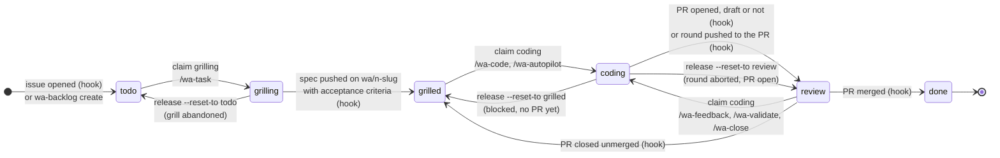
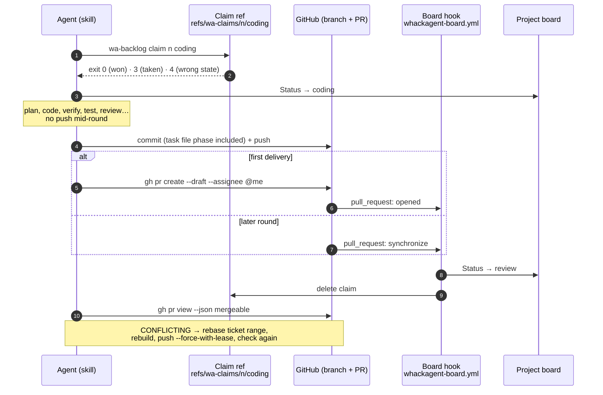
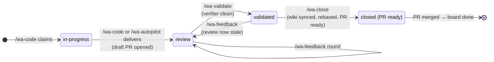
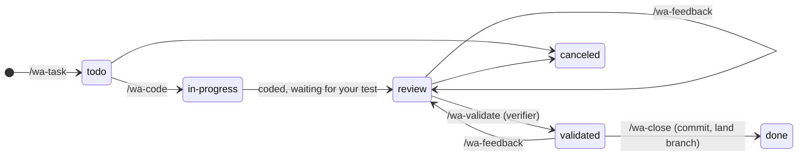

# Workflow — ticket state machine

How a whackagent ticket moves from idea to merged code, who moves it at each step, and what the board shows while it waits.

There are two levels:

- **Board state**: the six contract states (`providers/CONTRACT.md`), shown as the `Status` column of the GitHub Project when `backlog.provider: github`.
- **Coding sub-phase**: `phase:` in the task file on the ticket branch (`in-progress` → `review` → `validated`). It tracks how far the whackagent loop has gone. The board never shows it.

This page matches the hooks template `providers/github/whackagent-board.yml` at template version 8.

## Board states

| State | Meaning | Who is on turn | Entered by |
| --- | --- | --- | --- |
| `todo` | Ticket exists, not specified yet | Human, to start `/wa-task` | Issue opened (hook), or `wa-backlog create` |
| `grilling` | **Locked.** One agent is grilling the ticket with the user | Agent and human together | Agent `claim <n> grilling` |
| `grilled` | Spec written, ready to code | Anyone, to pick it up | Hook: branch `wa/<n>-<slug>` pushed with `{tasks}/<n>-*.md` holding non-empty acceptance criteria |
| `coding` | **Locked and transient.** One agent is working one round right now | Agent | Agent `claim <n> coding` |
| `review` | PR open. Draft means the human tests it; ready means the human merges it | Human | Hook: PR opened, or a round pushed to the PR while a coding claim is held |
| `done` | Change landed | Nobody | Hook: PR merged. The issue is closed, and the milestone too once it has no open issue |

### Two rules the diagram encodes

1. **Agents write only `grilling` and `coding`**, always through an atomic `claim`, and only undo them through `release`. `grilled`, `review` and `done` come from repository events, handled by the hooks. An agent never sets them, even when a hook is slow.
2. **`coding` never waits on a human.** Every agent round ends with a push. The first delivery opens a draft PR, and later rounds push to it. The hook then moves the ticket to `review` and drops the claim. A ticket waiting for your test is in `review`, never in `coding`.

## One agent round

Every command that touches a ticket branch after grilling (`/wa-code`, `/wa-autopilot`, `/wa-feedback`, `/wa-validate`, `/wa-close`) runs the same round:

- **Claim first.** Exit 3 means someone else is mid-round: the agent names the owner and stops, never retries or steals. Exit 4 means wrong state, for example `todo` when coding needs `grilled`.
- **No push mid-round.** A push to an open PR fires `synchronize`, which ends the round and drops the claim while the agent is still working.
- **The PR is self-assigned when created** (`--assignee @me`). The hooks never touch assignees.
- **A conflicting PR fires nothing.** GitHub runs no `pull_request` workflow when the PR's merge ref conflicts, so a push to a conflicting PR leaves the ticket in `coding` with the claim held. The round-end check catches this and rebases.
- **Draft ↔ ready moves nothing.** `ready_for_review` only posts a comment, and `converted_to_draft` does nothing. `/wa-close` marks the draft ready; `/wa-feedback` on a ready PR converts it back to draft first, so nobody merges code that is moving again.

## Coding sub-phase (task file)

Inside the loop, the task file's `phase:` tracks what has been proven. It is committed and pushed with each round, so it always matches the PR.

| Phase | Board state | Next command |
| --- | --- | --- |
| `in-progress` | `coding` | wait for the agent |
| `review` | `review`, draft PR | test it, then `/wa-feedback <n> <notes>` or `/wa-validate <n>` |
| `validated` | `review`, draft PR | retest, then `/wa-close <n>` |
| after `/wa-close` | `review`, ready PR | merge the PR on GitHub |

The same word appears at two levels. Board `review` means a PR is open and a human is on turn. `phase: review` means the code is delivered but the verifier has not judged it yet. `/wa-validate` runs the verifier once, over the whole ticket diff, when you say the feature matches the spec.

## Hook events

| Event | Condition | Result |
| --- | --- | --- |
| `issues: opened` | no `wa-ignore` label | added to the board as `todo` |
| `push` to `wa/**` | spec file with `issue: <n>` and non-empty acceptance criteria, state `todo` or `grilling` | `grilled`, grilling claim deleted |
| `pull_request: opened` / `reopened` | head `wa/<n>-…`, same repo, not `done`, draft or not | `review`, coding claim deleted |
| `pull_request: synchronize` | coding claim exists | `review`, coding claim deleted (round over) |
| `pull_request: ready_for_review` / `converted_to_draft` | none | nothing moves, claim untouched |
| `pull_request: closed`, merged | any base | `done`, issue closed, claims deleted, milestone closed when empty |
| `pull_request: closed`, unmerged | not `done` | `grilled`, coding claim deleted |

The workflow runs from the default branch for `issues` events and from the PR's merge ref for `pull_request` events. Both the default branch and the PR base (a sprint branch, for example) must therefore carry the current hooks. Older hooks are detected from the `template version:` header: versions 3 to 5 keep a draft PR in `coding`, and versions below 3 treat any opened PR as ready.

## Local provider

Without GitHub (`backlog.provider: local`), there is one agent and one checkout, and the task file's `status:` carries the whole lifecycle:

Only `/wa-close` commits in attended runs, and `/wa-autopilot` commits on its own task branches only.
