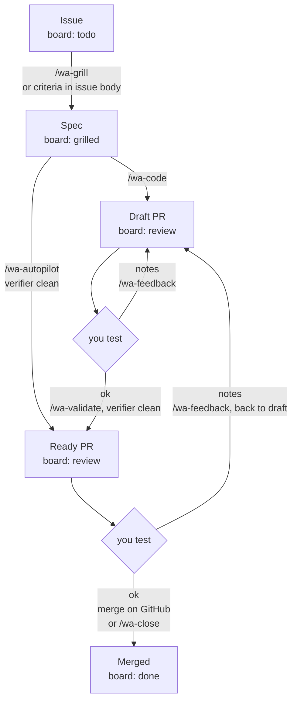
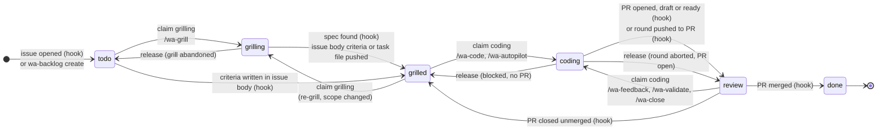
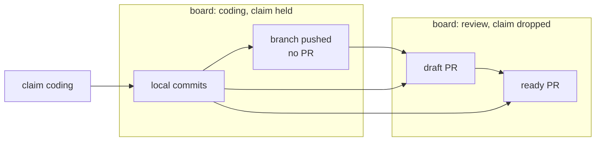
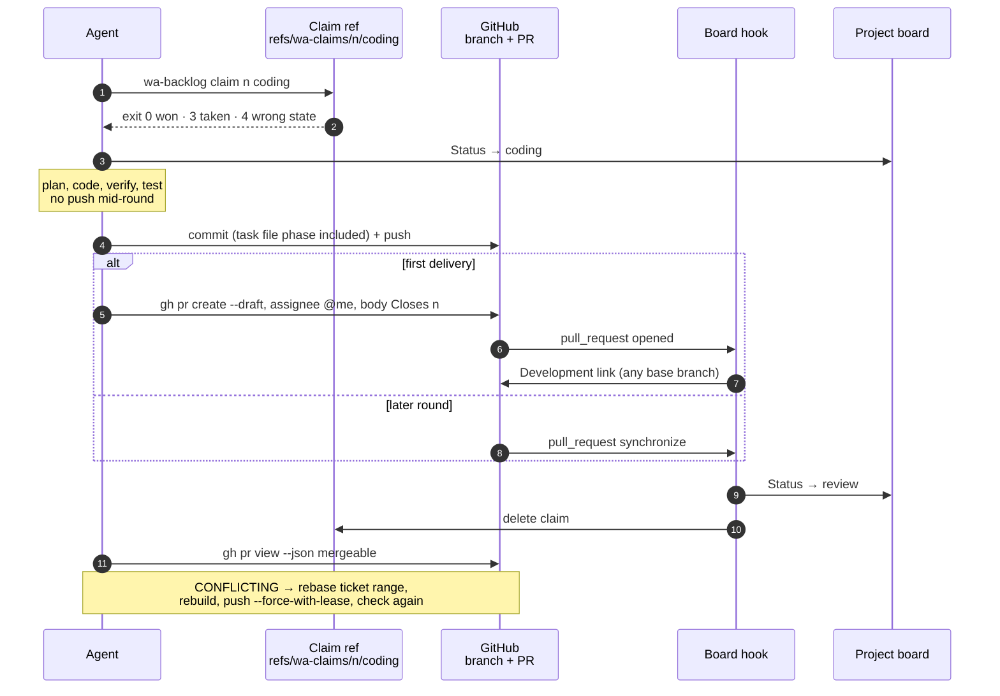
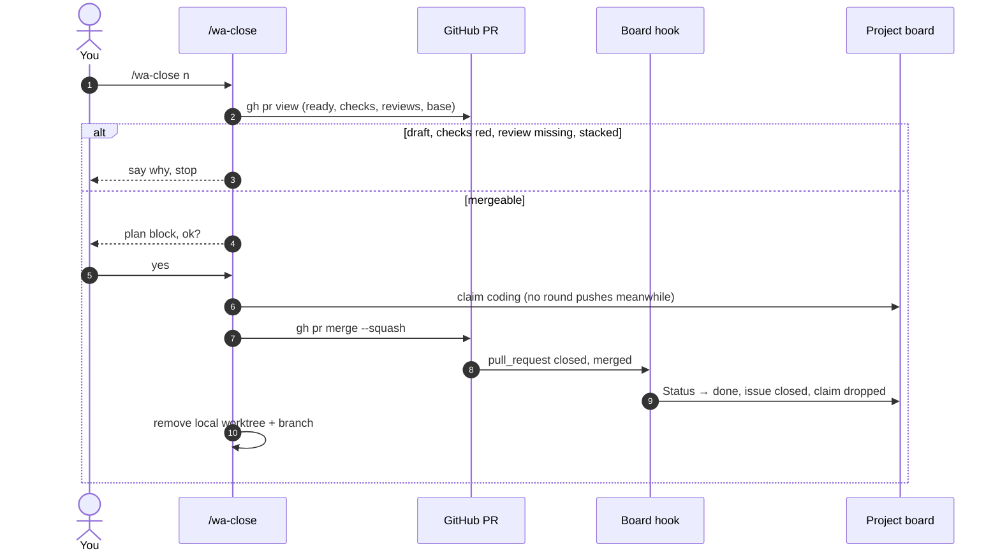
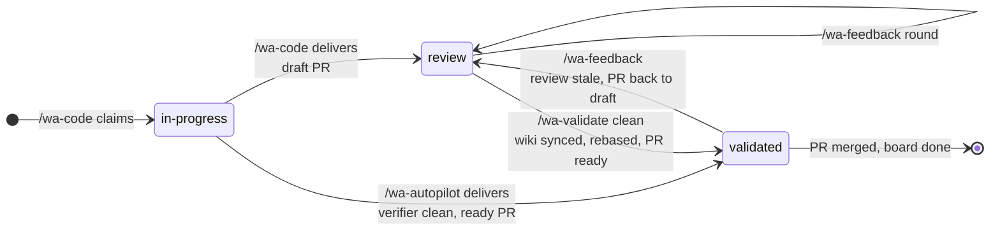
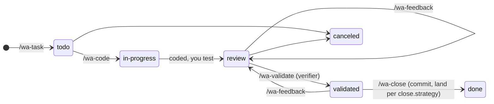

# Workflow

Ticket from idea to merged code. Who moves it, what board shows, what you do next.

- **Board state** — six contract states, GitHub Project `Status` column (`backlog.provider: github`). Rules: project's `BOARD.md`.
- **Task phase (whackagent only)** — `phase:` field of whackagent's task file `{tasks}/<n>-<slug>.md`, committed on ticket branch: `in-progress` → `review` → `validated`. Says how far whackagent loop got inside one board state (verifier run or not). Board never shows it. Dev without whackagent: no task file, no phase — PR draft / ready tells same story.

Matches board contract 2.0, hooks `hooks-v2`, caller template version 16.

## Big picture

```mermaid
flowchart TD
    I["Issue<br/>board: todo"] -->|"/wa-grill<br/>or criteria in issue body"| S["Spec<br/>board: grilled"]
    S -->|"/wa-code"| D["Draft PR<br/>board: review"]
    S -->|"/wa-autopilot<br/>verifier clean"| R
    D --> T{"you test"}
    T -->|"notes<br/>/wa-feedback"| D
    T -->|"ok<br/>/wa-validate, verifier clean"| R["Ready PR<br/>board: review"]
    R --> U{"you test"}
    U -->|"notes<br/>/wa-feedback, back to draft"| D
    U -->|"ok<br/>merge on GitHub<br/>or /wa-close"| M["Merged<br/>board: done"]
```

One rule: **workers take tickets, repository moves them.** Agents only claim and release. Every other state comes from a repository event, applied by the hooks.

## Board states

```mermaid
stateDiagram-v2
    direction LR

    [*] --> todo: issue opened (hook)<br/>or wa-backlog create

    todo --> grilling: claim grilling<br/>/wa-grill
    grilled --> grilling: claim grilling<br/>(re-grill, scope changed)
    grilling --> grilled: spec found (hook)<br/>issue body criteria or task file pushed
    todo --> grilled: criteria written in issue body (hook)
    grilling --> todo: release (grill abandoned)

    grilled --> coding: claim coding<br/>/wa-code, /wa-autopilot
    coding --> review: PR opened, draft or ready (hook)<br/>or round pushed to PR (hook)
    coding --> grilled: release (blocked, no PR)
    coding --> review: release (round aborted, PR open)

    review --> coding: claim coding<br/>/wa-feedback, /wa-validate, /wa-close
    review --> done: PR merged (hook)
    review --> grilled: PR closed unmerged (hook)

    done --> [*]
```

| State | Meaning | On turn | Entered by |
| --- | --- | --- | --- |
| `todo` | ticket exists, no spec | human: `/wa-grill` | hook: issue opened · `wa-backlog create` |
| `grilling` | **locked** — one agent writes spec with you | agent + you | `claim <n> grilling` |
| `grilled` | spec written, ready to code | anyone | hook: `## Acceptance criteria` in issue body, or task file pushed on `wa/<n>-<slug>` |
| `coding` | **locked** — one agent holds ticket, works on it | agent | `claim <n> coding` |
| `review` | PR open. Draft = you test. Ready = you merge | human | hook: PR opened, or claimed round pushed to it |
| `done` | change landed, issue closed | nobody | hook: PR merged |

Two rules:

1. **Agents write only `grilling`, `coding`** — atomic `claim`, undone by `release`. Never `grilled` / `review` / `done`, even when hook slow.
2. **Round ends with PR or release.** Ticket waiting for human sits in `review`, never `coding`.

## Who's on turn

| Board | Task phase | PR | You do | Next |
| --- | --- | --- | --- | --- |
| `coding` | `in-progress` | — | nothing, agent works | wait |
| `review` | `review` | draft | test | `/wa-feedback <n> <notes>` or `/wa-validate <n>` |
| `review` | `validated` | ready | test, merge | GitHub merge button, or `/wa-close <n>` |

Same word, two levels. Board `review` = PR open, human on turn. `phase: review` = coded, verifier not run.

## Any work loop

Board constrained, loop free. Dev may use whackagent, Codex, Cursor, other skill, plain git. Loop may stop wherever dev likes:

```mermaid
flowchart LR
    C["claim coding"] --> L["local commits"]
    L --> P["branch pushed<br/>no PR"]
    P --> DR["draft PR"]
    L --> DR
    DR --> RD["ready PR"]
    L --> RD
    subgraph coding ["board: coding, claim held"]
        L
        P
    end
    subgraph review ["board: review, claim dropped"]
        DR
        RD
    end
```

| Loop stops at | Board | Note |
| --- | --- | --- |
| local commits | `coding`, claim held | nobody else can test it yet |
| branch pushed, no PR | `coding`, claim held | push alone moves nothing |
| draft PR | `review` | you test |
| ready PR | `review` | you merge |

- Claim held, no push for `WA_STALE_AFTER_HOURS` (default 24) → board check comments on ticket. Only human clears stale lock.
- PR → ticket = the one issue it links (Development link or `Closes #n`), branch name `wa/<n>-…` as fallback. Any branch name works.
- **Human decides every merge.** GitHub button, or agent asked to merge that PR: ready, checks green, reviews in, squash, never `--admin`.

## whackagent loop

| Command | Claims | Git | PR after |
| --- | --- | --- | --- |
| `/wa-grill <n>` | `grilling` | spec → task file on ticket branch (`task: grill #<n>`) | — |
| `/wa-code <n>` | `coding` | commit + push, end of round | **draft**, self-assigned |
| `/wa-feedback <n> <notes>` | `coding` | ready PR → back to draft first, commit + push | draft |
| `/wa-validate <n>` | `coding` | verifier + autofix. Clean → wiki sync, rebase if base moved, commit + push | **ready**, reviewers requested. Findings open → stays draft |
| `/wa-autopilot` | `coding` per ticket | same as code + validate, unattended | ready (clean) · draft (findings) |
| `/wa-close <n>` | `coding` (while merging) | checks → plan → your yes → `gh pr merge --squash` | merged → `done` |
| `/wa-close <sprint>` | — | sprint PR, then merge (merge commit) on second yes | merged → sprint parent closed |

- Every PR assigned to `@me`, plus `pr.assignees`.
- Ticket PRs squash. Sprint, track, sync PRs merge commit, never squash.
- `/wa-close` refuses: draft PR (→ `/wa-validate`), failing checks, missing required review, stacked on unmerged ticket. GitHub refuses merge → claim released to `review`, reason said.

## One agent round

Every command touching ticket branch after grilling runs same round:

```mermaid
sequenceDiagram
    autonumber
    participant A as Agent
    participant C as Claim ref<br/>refs/wa-claims/n/coding
    participant G as GitHub<br/>branch + PR
    participant H as Board hook
    participant B as Project board

    A->>C: wa-backlog claim n coding
    C-->>A: exit 0 won · 3 taken · 4 wrong state
    A->>B: Status → coding
    Note over A: plan, code, verify, test<br/>no push mid-round
    A->>G: commit (task file phase included) + push
    alt first delivery
        A->>G: gh pr create --draft, assignee @me, body Closes n
        G->>H: pull_request opened
        H->>G: Development link (any base branch)
    else later round
        G->>H: pull_request synchronize
    end
    H->>B: Status → review
    H->>C: delete claim
    A->>G: gh pr view --json mergeable
    Note over A,G: CONFLICTING → rebase ticket range,<br/>rebuild, push --force-with-lease, check again
```

- **Claim first.** Exit 3 → someone mid-round: name owner, stop, never steal. Exit 4 → wrong state.
- **No push mid-round.** Push to open PR = `synchronize` = round over, claim dropped.
- **Conflicting PR fires nothing.** GitHub runs no `pull_request` workflow on conflict: ticket stuck in `coding` until rebase.
- **Draft ↔ ready moves nothing.** `ready_for_review` comments only. Clean `/wa-validate` marks ready. `/wa-feedback` on ready PR flips it back to draft first.
- **Nothing to push** → `release <n> coding --reset-to review` (PR open) or `--reset-to grilled` (no PR).

## Merge

```mermaid
sequenceDiagram
    autonumber
    actor U as You
    participant A as /wa-close
    participant G as GitHub PR
    participant H as Board hook
    participant B as Project board

    U->>A: /wa-close n
    A->>G: gh pr view (ready, checks, reviews, base)
    alt draft, checks red, review missing, stacked
        A-->>U: say why, stop
    else mergeable
        A-->>U: plan block, ok?
        U->>A: yes
        A->>B: claim coding (no round pushes meanwhile)
        A->>G: gh pr merge --squash
        G->>H: pull_request closed, merged
        H->>B: Status → done, issue closed, claim dropped
        A->>A: remove local worktree + branch
    end
```

Merging on GitHub yourself = same end. Hook sets `done` either way.

## Task phase (whackagent only)

Task file `phase:`, committed and pushed each round — always matches PR.

```mermaid
stateDiagram-v2
    direction LR

    [*] --> in_progress: /wa-code claims
    in_progress --> phase_review: /wa-code delivers<br/>draft PR
    in_progress --> validated: /wa-autopilot delivers<br/>verifier clean, ready PR
    phase_review --> phase_review: /wa-feedback round
    phase_review --> validated: /wa-validate clean<br/>wiki synced, rebased, PR ready
    validated --> phase_review: /wa-feedback<br/>review stale, PR back to draft
    validated --> [*]: PR merged, board done

    state "in-progress" as in_progress
    state "review" as phase_review
    state "validated" as validated
```

## Hook events

| Event | Condition | Result |
| --- | --- | --- |
| `issues: opened` | no `wa-ignore` / `wa-sprint` label | card added, `todo` |
| `issues: edited` | body holds non-empty `## Acceptance criteria`, card `todo` / `grilling`, editor can push | `grilled`, grilling claim dropped. Editor can't push → reported, card stays |
| `push` to `wa/**` | task file `issue: <n>` with non-empty criteria, card `todo` / `grilling` | `grilled`, grilling claim dropped |
| `pull_request: opened` / `reopened` | links one ticket of this repo, not a sprint PR, not `done` | `review`, claims dropped, Development link added if missing; card watched ~30 s against built-in workflow |
| `pull_request: edited` | link found late, card `todo` / `grilled` | `review` |
| `pull_request: synchronize` | coding claim held | `review`, claim dropped, new `## Feedback` round linked |
| `pull_request: synchronize` | no claim (not GitHub's own merge) | comment on PR, board untouched |
| `pull_request: ready_for_review` / `converted_to_draft` | — | nothing moves |
| `pull_request: closed`, merged | ticket PR | `done`, issue closed, claims dropped. Sprint without branch, last ticket → sprint parent closed |
| `pull_request: closed`, merged | head = sprint branch | sprint parent closed |
| `pull_request: closed`, unmerged | not `done`, no coding claim, no other open PR for ticket | `grilled` |
| scheduled, once a day on weekdays at 06:17 UTC (cron `17 6 * * 1-5`), or run by hand (`workflow_dispatch`) | — | board check, report only |

Card in column outside six states → hooks hands off. Except coding claim held → card taken back (GitHub built-in "Pull request linked to issue" workflow moves it; switch that off).

## Board check

Once a day on weekdays (06:17 UTC), or by hand: `gh workflow run whackagent-board.yml`. **Reports, never moves cards.** One comment per problem, flipped to resolved once fixed.

On ticket:

- `grilling` / `coding` card, no claim held
- claim held, nothing new for `WA_STALE_AFTER_HOURS` (age = newer of claim and branch's last commit)
- `review` card, no open PR
- linked PR open, card `todo` / `grilled`
- linked PR merged, card not `done`
- `grilled` card, no spec
- criteria in issue body, card `todo`
- `done` card, issue open
- closed issue in lock column
- issue closed as completed, card not `done`

On PR, as it happens: push without coding claim · PR linking several tickets.

## Local provider

No GitHub (`backlog.provider: local`): one agent, one checkout. Task file `status:` carries everything.

```mermaid
stateDiagram-v2
    direction LR
    [*] --> todo: /wa-task
    todo --> in_progress: /wa-code
    in_progress --> review: coded, you test
    review --> review: /wa-feedback
    review --> validated: /wa-validate (verifier)
    validated --> review: /wa-feedback
    validated --> done: /wa-close (commit, land per close.strategy)
    todo --> canceled
    review --> canceled
    state "in-progress" as in_progress
```

- Only `/wa-close` commits in attended runs. `/wa-autopilot` commits on its own task branches only.
- `close.strategy`: `nothing` (commit, branch kept) · `pr` (PR left ready, never merged) · `merge` (local merge, no push).
